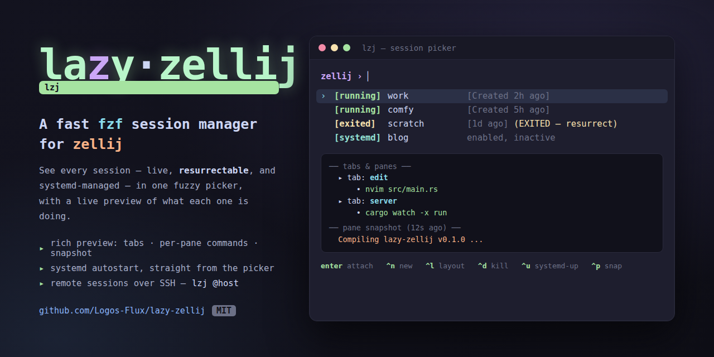

<p align="center">
  
</p>

# lazy-zellij

A fast, `fzf`-based session manager for [zellij](https://zellij.dev) — plus a
small imperative helper and optional systemd integration for autostarting
sessions and previewing what each one is doing, even after you've detached.

The main command is **`lzj`** ("lazy zellij"). It gives you a fuzzy picker over
all your sessions — live, exited-but-resurrectable, and systemd-managed — with a
rich preview pane showing each session's tabs, the command running in every
pane, attached clients, and a periodically-captured snapshot of the screen.

```
zellij ›
> [running]  work                   [Created 2h ago]
  [running]  comfy                  [Created 5h ago]
  [exited]   scratch                [Created 1d ago] (EXITED - attach to resurrect)
  [systemd]  blog                   systemd: enabled, inactive
  ┌─ preview ──────────────────────────────────────────┐
  │ name    work                                        │
  │ kind    running                                     │
  │ ── tabs & panes ──                                  │
  │   ▸ tab: edit                                       │
  │       • nvim src/main.rs                            │
  │   ▸ tab: server                                     │
  │       • cargo watch -x run                          │
  │ ── pane snapshot (12s ago) ──                       │
  │   Compiling lazy-zellij v0.1.0                      │
  └────────────────────────────────────────────────────┘
enter:attach  ^n:new  ^l:layout  ^d:kill  ^x:delete  ^u:systemd-up …
```

## Why

`zellij` ships `attach`/`list-sessions`, but day to day you want to *see* your
sessions and jump between them without typing names. `lazy-zellij` adds:

- **A picker** that fuses live sessions, resurrectable (exited) sessions, and
  systemd-managed ones into a single fuzzy list.
- **A real preview** — tabs and per-pane commands pulled from
  `zellij action dump-layout` (works on detached sessions too), plus a live
  screen snapshot so you can tell sessions apart at a glance.
- **systemd autostart** — promote any session to a boot-time `zellij@<name>`
  unit straight from the picker (`ctrl-u`).
- **Remote sessions** — `lzj @host` drives `lzj` over SSH on another machine,
  so one keystroke browses sessions anywhere.

## Components

| File | What it is |
|------|------------|
| `bin/lzj` | The fzf picker (interactive) + a thin CLI (`lzj <name>`, `lzj ls`, `lzj @host …`). |
| `bin/zj` | Imperative one-liners: `zj <name>`, `zj new`, `zj up/down`, `zj kill`, `zj rm`. No fzf needed. |
| `bin/lzj-snapshot` | Captures each active session's focused pane to `~/.cache/lzj/snapshots/` so the picker preview has fresh content. |
| `systemd/zellij@.service` | Templated unit — `systemctl --user enable --now zellij@work` autostarts a detached session `work` on boot. Idempotent. |
| `systemd/lzj-snapshot.{service,timer}` | Runs `lzj-snapshot` every 30s. |

## Requirements

- [`zellij`](https://zellij.dev) (developed against 0.43–0.44)
- [`fzf`](https://github.com/junegunn/fzf)
- `python3` (powers the tab/pane tree in the preview)
- `bash`, and `systemd` **only** if you want autostart + auto-snapshots (optional)

## Install

```sh
git clone https://github.com/Logos-Flux/lazy-zellij.git
cd lazy-zellij
./install.sh
```

This installs the three scripts to `~/.local/bin` and the systemd `--user`
units, then enables the snapshot timer. Options:

```sh
./install.sh --no-systemd   # scripts only, no systemd
./install.sh --uninstall    # remove everything it installed
BIN_DIR=~/bin ./install.sh  # install scripts elsewhere
```

Make sure `~/.local/bin` is on your `PATH`. To keep user services running after
you log out (so autostarted sessions survive a reboot), run once:

```sh
sudo loginctl enable-linger "$USER"
```

For session persistence (so exited sessions resurrect with their tabs/scrollback
intact), enable serialization in `~/.config/zellij/config.kdl`:

```kdl
session_serialization true
serialize_pane_viewport true
```

## Usage

### `lzj` — the picker

```
lzj                   open the picker
lzj <name>            attach to a session (create if missing)
lzj <name> -l <lay>   attach; if missing, create with layout <lay> (built-in name,
                      a stem from ~/.config/zellij/layouts/, or a path).
                      If the session is running, opens <lay> as a new tab.
lzj layouts           list available layouts
lzj ls                list local sessions + systemd units
lzj @<host>           open the picker on a remote host over SSH
lzj @<host> <name>    attach to a remote session directly
lzj help              full help
```

Keys inside the picker:

| Key | Action |
|-----|--------|
| `enter` | attach to the selected session (creates if missing) |
| `ctrl-n` | prompt for a new session name (detached) |
| `ctrl-l` | pick a layout and apply it (new tab if running, fresh create otherwise) |
| `ctrl-d` | kill the selected session (confirms) |
| `ctrl-x` | delete (forget) a dead session from the resurrection list |
| `ctrl-u` | `systemctl --user enable --now zellij@<name>` (autostart on boot) |
| `alt-u` | `systemctl --user disable --now zellij@<name>` |
| `ctrl-p` | force a snapshot now (otherwise every ~30s) |
| `ctrl-r` | reload the list |
| `esc` / `ctrl-c` | quit |

### `zj` — imperative helper

For when you don't want a picker:

```
zj                    attach to "main" (create if missing)
zj <name>             attach to <name> (create if missing)
zj new <name>         create a detached session, don't attach
zj up <name>          systemctl --user enable --now zellij@<name>
zj down <name>        systemctl --user disable --now zellij@<name>
zj kill <name>        kill the running session
zj rm <name>          delete a dead session from the resurrection list
zj ls / zj units      list sessions / systemd units
```

### Remote hosts

`lzj @<host>` passes `<host>` straight to `ssh`, so any `~/.ssh/config` alias
works: `lzj @myserver`, `lzj @myserver ls`, `lzj @myserver work`.

To add short aliases, create `~/.config/lzj/hosts` and define `resolve_host_user`:

```sh
# ~/.config/lzj/hosts
resolve_host_user() {
    case "$1" in
        p|prod)  echo prod.example.com ;;
        s|stage) echo staging.example.com ;;
        *)       echo "" ;;   # fall through to the default (verbatim) handling
    esac
}
```

Keeping host shortcuts in this file (rather than editing `bin/lzj`) keeps your
machine names out of the installed script.

## Notes & limitations

- Session names are restricted to a single printable token (no spaces, tabs,
  newlines, or control characters). `lzj` rejects anything else — this is a
  deliberate guard so stray output can never be turned into a phantom session.
- `dump-screen` snapshots only capture the **focused** pane of sessions that
  currently have an attached client; detached sessions keep their last-seen
  snapshot.
- Built and tested on Linux with `systemd --user`. The scripts themselves work
  without systemd (you just lose autostart and auto-snapshots).

## License

[MIT](LICENSE) © Logos-Flux
